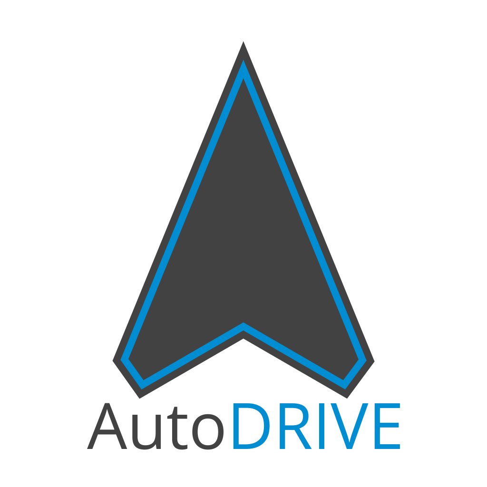

<p align="center">
  <br>
  <b>An Integrated Cyber-Physical Ecosystem for Autonomous Driving Research and Education</b>
</p>

<p align="center">


</p>

## Project Overview


<p align="justify">
AutoDRIVE is envisioned to be an integrated platform for autonomous driving research and education. It bridges the gap between software simulation and hardware deployment by providing the AutoDRIVE Simulator and AutoDRIVE Testbed, a well-suited duo for sim2real applications. It also offers AutoDRIVE Devkit, a developer's kit for rapid and flexible development of autonomy algorithms. Although the platform is primarily targeted towards autonomous driving, it also supports the development of smart-city solutions for managing the traffic flow.
</p>

## AutoDRIVE Testbed

|  |  |
|:--------:|:-------------:|
| Vehicle | Infrastructure |

<p align="justify">
AutoDRIVE Testbed is the hardware setup comprising of a scaled vehicle model (called Nigel) and a modular infrastructure development kit. The vehicle is equipped with a comprehensive sensor suite for redundant perception, a set of actuators for constrained motion control and a fully functional lighting system for illumination and signaling. It can be teleoperated (in manual mode) or self-driven (in autonomous mode). The infrastructure development kit comprises of various environment modules along with active and passive traffic elements.
</p>

- **Source Branch:** [AutoDRIVE Testbed](https://github.com/Tinker-Twins/AutoDRIVE/tree/AutoDRIVE-Testbed)
- **Latest Release:** [AutoDRIVE Testbed 0.1.0](https://github.com/Tinker-Twins/AutoDRIVE/releases/tag/Testbed-0.1.0)
- **Upcoming Release:** AutoDRIVE Testbed 0.2.0 is currently under development.

## AutoDRIVE Simulator

|  |  |
|:--------:|:-------------:|
| Vehicle | Infrastructure |

<p align="justify">
AutoDRIVE Simulator is the digital twin of the AutoDRIVE Testbed, which enables the users to virtually prototype their algorithms either due to hardware limitations or as a part of the reiterative development cycle. It is developed atop the Unity game engine and offers a WebSocket interface for bilateral communication with the autonomy algorithms developed independently using the AutoDRIVE Devkit. The standalone simulator application is targeted at Full HD resolution (1920x1080p) with cross-platform support (Windows, macOS and Linux). It is a light-weight software application that utilizes system resources wisely. This enables deployment of the simulator application and autonomy algorithms on a single machine; nonetheless, distributed computing is also supported.
</p>

- **Source Branch:** [AutoDRIVE Simulator](https://github.com/Tinker-Twins/AutoDRIVE/tree/AutoDRIVE-Simulator)
- **Latest Release:** [AutoDRIVE Simulator 0.2.0](https://github.com/Tinker-Twins/AutoDRIVE/releases/tag/Simulator-0.2.0)
- **Upcoming Release:** AutoDRIVE Simulator 0.3.0 is currently under development.

## AutoDRIVE Devkit

|  |  |
|:--------:|:-------------:|
| ADSS Toolkit | SCSS Toolkit |

<p align="justify">
AutoDRIVE Devkit is a developer's kit that enables the users to exploit AutoDRIVE Simulator or AutoDRIVE Testbed for rapid and flexible development of autonomy algorithms pertaining to autonomous driving (using ADSS Toolkit) as well as smart city management (using SCSS Toolkit). It supports local (decentralized) as well as distributed (centralized) computing and is compatible with Robot Operating System (ROS), while also offering a direct scripting support for Python and C++.
</p>

- **Source Branch:** [AutoDRIVE Devkit](https://github.com/Tinker-Twins/AutoDRIVE/tree/AutoDRIVE-Devkit)
- **Latest Release:** [AutoDRIVE Devkit 0.2.1](https://github.com/Tinker-Twins/AutoDRIVE/releases/tag/Devkit-0.2.1)
- **Upcoming Release:** AutoDRIVE Devkit 0.3.0 is currently under development.

## Awards and Recognition
- [Best Paper Award](http://ccris2023.net/ccris2021.html) for Paper "AutoDRIVE Simulator: A Simulator for Scaled Autonomous Vehicle Research and Education" at CCRIS 2021
- [Best Project Award](https://www.youtube.com/watch?v=VUo4UFiTnd4&t=4048s) for "AutoDRIVE – An Integrated Platform for Autonomous Driving Research and Education" at National Level IEEE Project Competition 2021
- [Best Project Award](https://youtu.be/2FByDOkDxMc?t=1892) for "AutoDRIVE – An Integrated Platform for Autonomous Driving Research and Education" at SRMIST Mechatronics Department 2021
- [Gold Medal](https://arxiv.org/abs/2211.08475) for Paper "AutoDRIVE – An Integrated Platform for Autonomous Driving Research and Education" at SRMIST Research Day 2021
- [Lightning Talk](https://vimeo.com/480566576) of "AutoDRIVE Simulator: A Simulator for Scaled Autonomous Vehicle Research and Education" at ROS World 2020
- [India Connect @ NTU Research Fellowship](https://arxiv.org/abs/2211.07022v2) 2020 for "AutoDRIVE Simulator"

## Resources

### Presentations

We encourage you to take a look at the following presentations to gain a better insight into the AutoDRIVE project.

|                    |
|:------------------:|
| [](https://youtu.be/t0CgNR_LgrQ) |
| [AutoDRIVE Ecosystem Pitch Video](https://youtu.be/t0CgNR_LgrQ) |
|                    |

|                    |                     |
|:------------------:|:-------------------:|
| [](https://youtu.be/i7R79jwnqlg) | [](https://youtu.be/YFQzyfXV6Rw) |
| [AutoDRIVE Simulator Pitch Video](https://youtu.be/i7R79jwnqlg) | [AutoDRIVE Testbed Pitch Video](https://youtu.be/YFQzyfXV6Rw) |
| [](https://youtu.be/2FByDOkDxMc) | [](https://youtu.be/whTH6VyVtHE) |
| [SRMIST UG Final Year Project Viva Voce](https://youtu.be/2FByDOkDxMc) | [CCRIS 2021 Virtual Presentation](https://youtu.be/whTH6VyVtHE) |
|                    |                     |

### Demonstrations

We encourage you to take a look at the following research projects developed using the AutoDRIVE platform.

|                    |                     |
|:------------------:|:-------------------:|
| [](https://youtu.be/piCyvTM2dek) | [](https://youtu.be/rejpoogaXOE) |
| [Autonomous Parking](https://youtu.be/piCyvTM2dek) | [Behavioural Cloning](https://youtu.be/rejpoogaXOE) |
| [](https://youtu.be/AEFJbDzOpcM) | [](https://youtu.be/fnxOpV1gFXo) |
| [Intersection Traversal](https://youtu.be/AEFJbDzOpcM) | [Smart City Management](https://youtu.be/fnxOpV1gFXo) |
|                    |                     |

### Publications

We encourage you to read and cite the following papers if you use any part of this project for your research:

#### [AutoDRIVE: A Comprehensive, Flexible and Integrated Digital Twin Ecosystem for Enhancing Autonomous Driving Research and Education](https://arxiv.org/abs/2212.05241)
```bibtex
@article{AutoDRIVE-Ecosystem-2023,
author = {Samak, Tanmay and Samak, Chinmay and Kandhasamy, Sivanathan and Krovi, Venkat and Xie, Ming},
title = {AutoDRIVE: A Comprehensive, Flexible and Integrated Digital Twin Ecosystem for Autonomous Driving Research &amp; Education},
journal = {Robotics},
volume = {12},
year = {2023},
number = {3},
article-number = {77},
url = {https://www.mdpi.com/2218-6581/12/3/77},
issn = {2218-6581},
doi = {10.3390/robotics12030077}
}
```
This work has been published in **MDPI Robotics.** The open-access publication can be found on [MDPI](https://doi.org/10.3390/robotics12030077).

#### [AutoDRIVE Simulator: A Simulator for Scaled Autonomous Vehicle Research and Education](https://arxiv.org/abs/2103.10030)
```bibtex
@inproceedings{AutoDRIVE-Simulator-2021,
author = {Samak, Tanmay Vilas and Samak, Chinmay Vilas and Xie, Ming},
title = {AutoDRIVE Simulator: A Simulator for Scaled Autonomous Vehicle Research and Education},
year = {2021},
isbn = {9781450390453},
publisher = {Association for Computing Machinery},
address = {New York, NY, USA},
url = {https://doi.org/10.1145/3483845.3483846},
doi = {10.1145/3483845.3483846},
booktitle = {2021 2nd International Conference on Control, Robotics and Intelligent System},
pages = {1–5},
numpages = {5},
location = {Qingdao, China},
series = {CCRIS'21}
}
```
This work has been published at **2021 International Conference on Control, Robotics and Intelligent System (CCRIS).** The publication can be found on [ACM Digital Library](https://dl.acm.org/doi/abs/10.1145/3483845.3483846).

#### [Towards Mechatronics Approach of System Design, Verification and Validation for Autonomous Vehicles](https://arxiv.org/abs/2301.13425)
```bibtex
@inproceedings{AutoDRIVE-Mechatronics-2023,
author = {Samak, Chinmay and Samak, Tanmay and Krovi, Venkat},
booktitle = {2023 IEEE/ASME International Conference on Advanced Intelligent Mechatronics (AIM)}, 
title = {Towards Mechatronics Approach of System Design, Verification and Validation for Autonomous Vehicles}, 
year = {2023},
volume = {},
number = {},
pages = {1208-1213},
doi = {10.1109/AIM46323.2023.10196233},
url = {https://doi.org/10.1109/AIM46323.2023.10196233}
}
```
This work has been published at **2023 IEEE/ASME International Conference on Advanced Intelligent Mechatronics (AIM).** The publication can be found on [IEEE Xplore](https://ieeexplore.ieee.org/document/10196233).

#### [Towards Sim2Real Transfer of Autonomy Algorithms using AutoDRIVE Ecosystem](https://arxiv.org/abs/2307.13272)
```bibtex
@eprint{AutoDRIVE-Sim2Real-2023,
title={Towards Sim2Real Transfer of Autonomy Algorithms using AutoDRIVE Ecosystem}, 
author={Chinmay Vilas Samak and Tanmay Vilas Samak and Venkat Krovi},
year={2023},
eprint={2307.13272},
archivePrefix={arXiv},
primaryClass={cs.RO}
}
```
This work has been accepted at **2023 AACC/IFAC Modeling, Estimation and Control Conference (MECC).**

### Technical Reports

We encourage you to read and cite the following technical reports if you use any part of this project for your research (these can serve as a good source of documentation as well):

#### [AutoDRIVE - Technical Report](https://arxiv.org/abs/2211.08475)
```bibtex
@misc{AutoDRIVE-Technical-Report,
doi = {10.48550/ARXIV.2211.08475},
url = {https://arxiv.org/abs/2211.08475},
author = {Samak, Tanmay Vilas and Samak, Chinmay Vilas},
keywords = {Robotics (cs.RO), FOS: Computer and information sciences, FOS: Computer and information sciences},
title = {AutoDRIVE - Technical Report},
publisher = {arXiv},
year = {2022},
copyright = {arXiv.org perpetual, non-exclusive license}
}
```

#### [AutoDRIVE Simulator - Technical Report](https://arxiv.org/abs/2211.07022)
```bibtex
@misc{AutoDRIVE-Simulator-Technical-Report,
doi = {10.48550/ARXIV.2211.07022},
url = {https://arxiv.org/abs/2211.07022},
author = {Samak, Tanmay Vilas and Samak, Chinmay Vilas},
keywords = {Robotics (cs.RO), FOS: Computer and information sciences, FOS: Computer and information sciences},
title = {AutoDRIVE Simulator - Technical Report},
publisher = {arXiv},
year = {2022},
copyright = {arXiv.org perpetual, non-exclusive license}
}
```
